# INTERPRETATION

## Data Insights

### Emergency Encounters
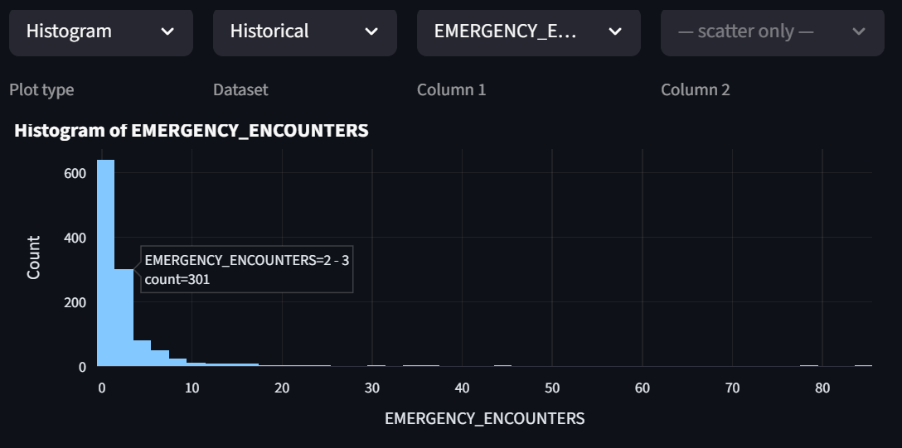
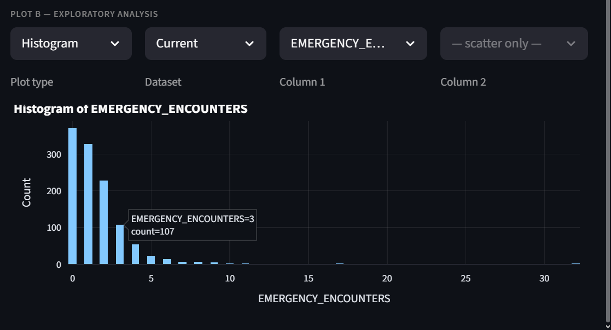
The number of emergency room encounters has gone down between the two periods.

### Patient Emergency Risk
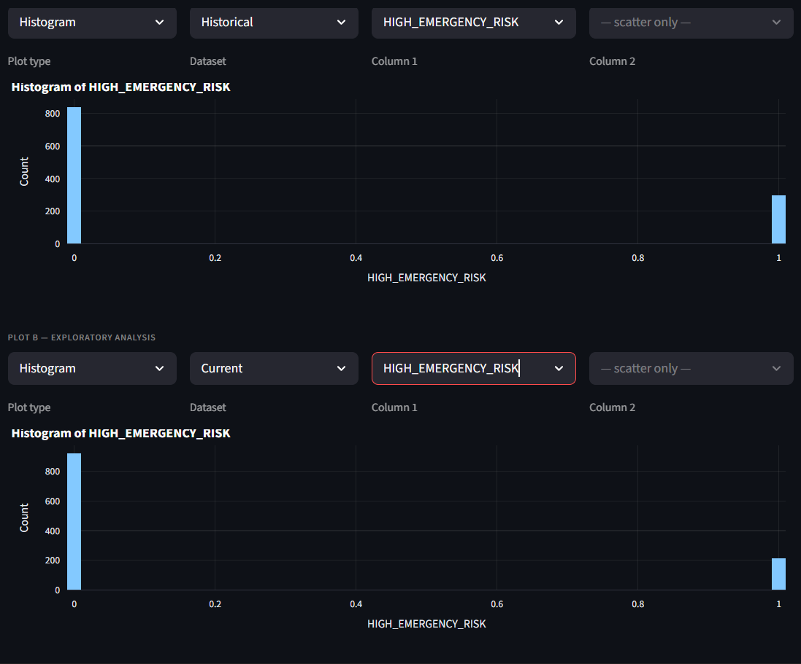
There are fewer high risk patients currently than historically.

### Age distribution
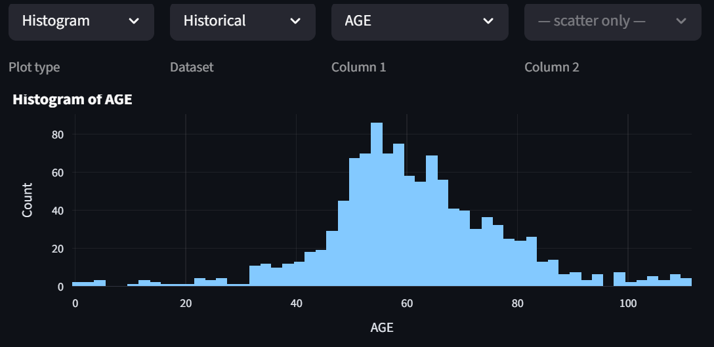
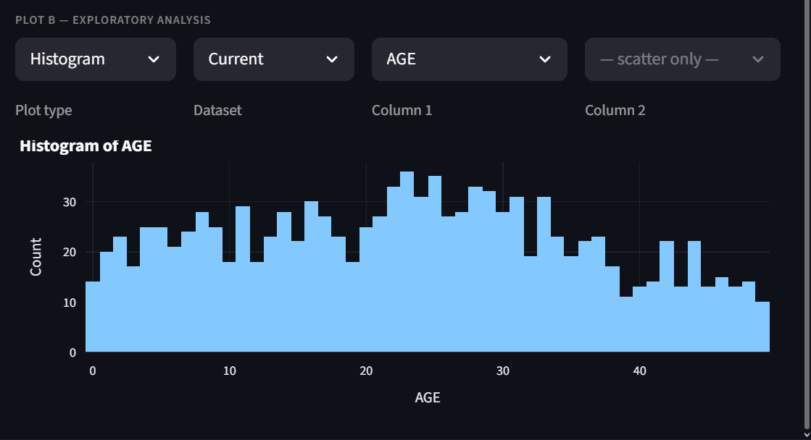
As expected, the historical dataset has an approximately normal distribution of ages centred around 60, significantly older than the current dataset.

### Emergency Encounters vs Income
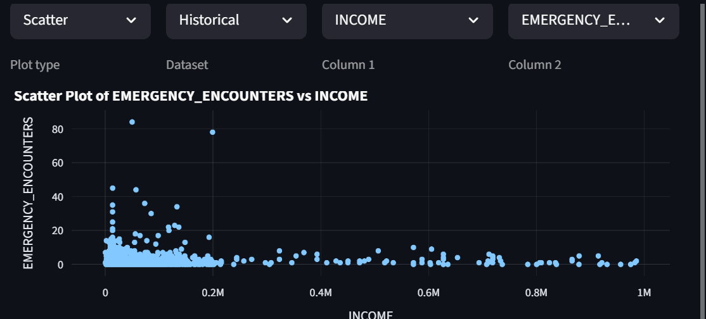
Lower income patients are more susceptible to emergency room visits.

### Healthcare Coverage
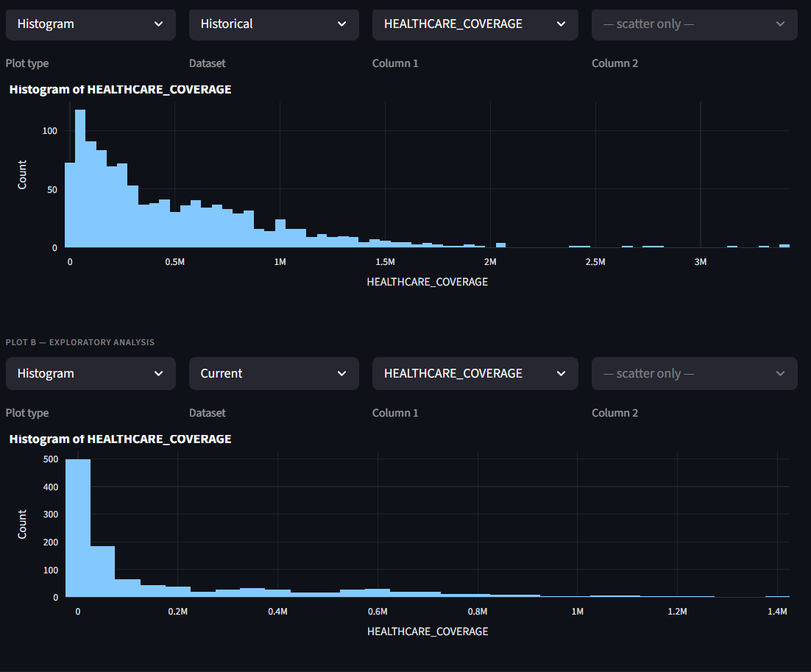
The distribution of healthcare coverage has become heavily skewed to lower coverage per patient between the two periods.

## Model Interpretation

### SVC
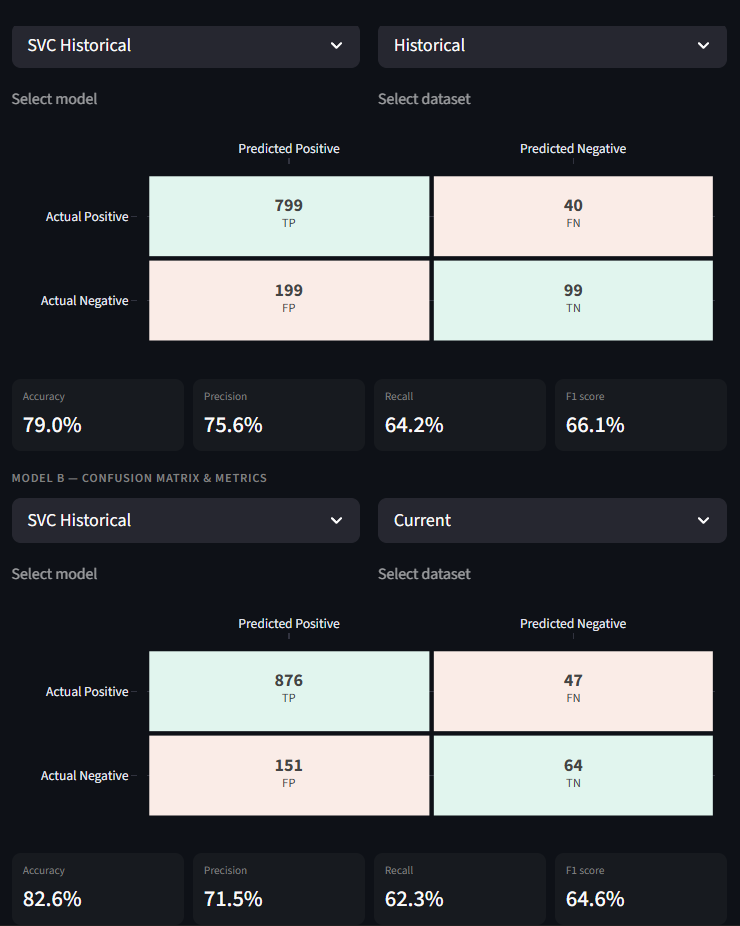
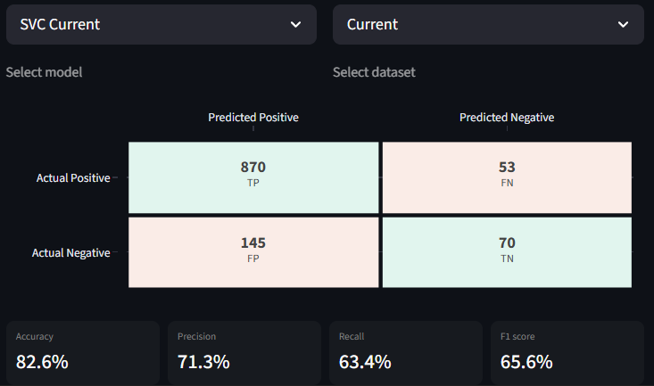
The historical model does about equally when scored on accuracy on both datasets. Finetuning does not appear to have a significant improvement, suggesting that the level of stationarity required by the SVC is met.

### Decision Tree
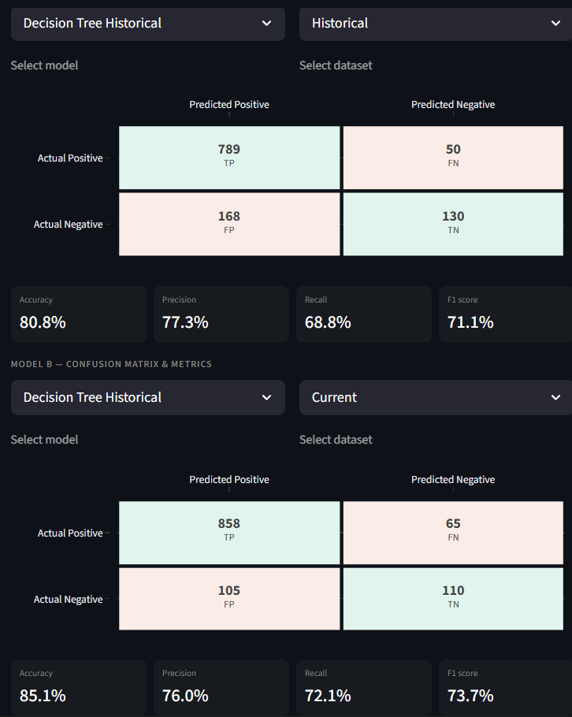
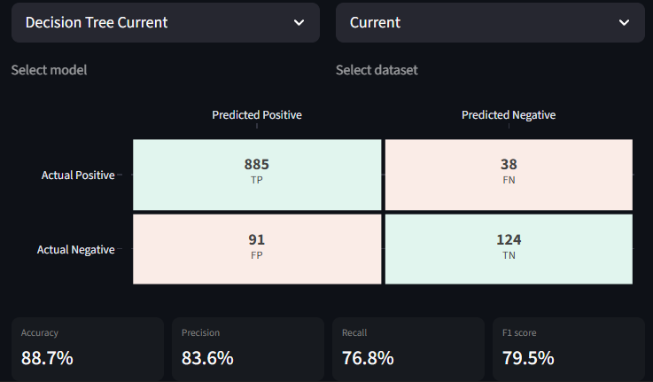
Finetuning on current data significantly improves the decision tree's metrics. Overall, the decision tree classification performs the best for the problem at hand.

### MLP
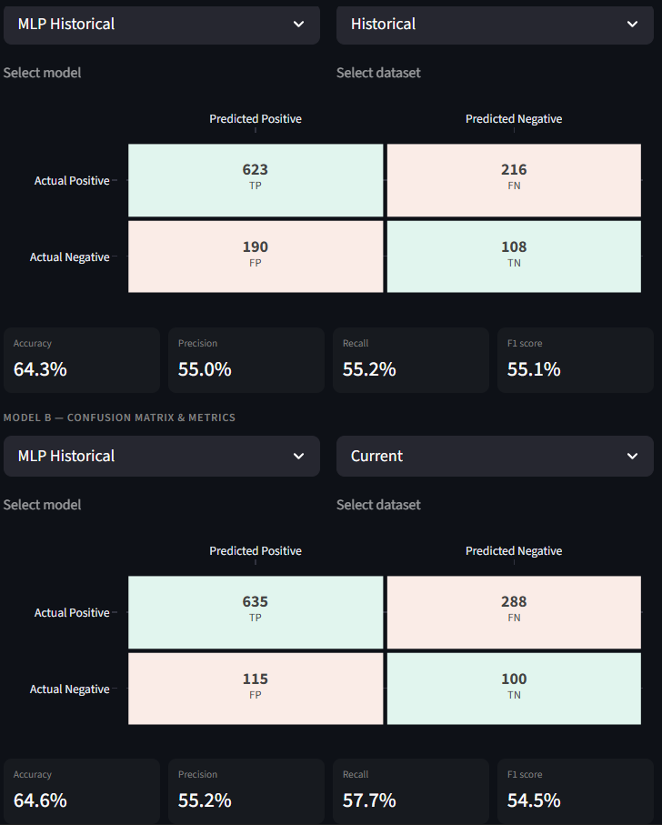
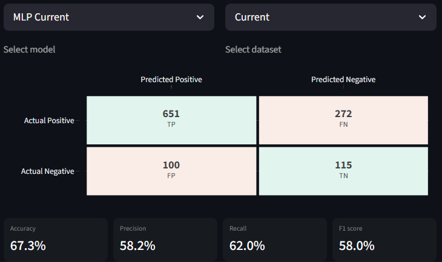
The MLP models perform the poorest for the problem at hand, however, finetuning does seem to help slightly. The issue could be the insufficient training.